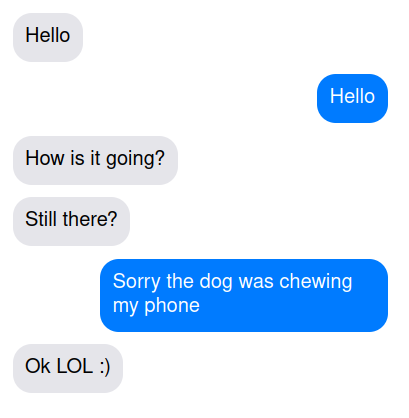

# createchat

Simple application to create chat bubbles from script.

The script should be in format:
A: Hello
B: Hello
A: How is it going?
A: Still there?
B: Sorry the dog was chewing my phone
A: Ok LOL :)

This will create a chat page looking like this:

## Usage

### Docker

Container listens port 5777 by default.

build image: `make build`

run container: `make run`

stop and remove container: `make stop`
